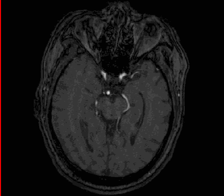
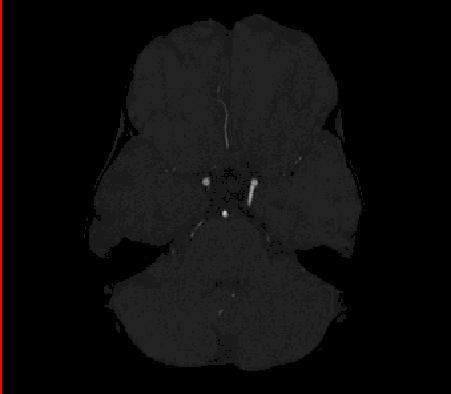

# Adaptive local extraction and global aggregation of structures in cerebrovascular segmentation

This is the official implementation of MorphSeg in <i>Adaptive local extraction and global aggregation of structures in cerebrovascular segmentation</i>. 
MorphSeg is a structure-guided model specifically designed for cerebrovascular segmentation, aiming to identify fine-grained and complex vascular structures. MorphSeg addresses these challenges by leveraging three core modules: Dynamic Feature Extraction, Local Direction-Adaptive Fusion, and Global Multi-Source Aggregation, significantly enhancing the model's ability to capture vascular morphology.

- [1. Model Architecture](#1-model-architecture)
- [2. Segmentation Example](#2-segmentation-example)
- [3. Datasets](#3-datasets)
- [4. Installation Guide](#4-installation-guide)
- [5. Run](#5-run)
- [6. Logs and Results](#6-logs-and-results)
- [7. Failure Cases](#7-failure-cases)
- [8. Acknowledgement](#8-acknowledgement)
- [9. Citation](#9-citation)


## 1 Model Architecture


## 2 Segmentation Example

Segmentation examples are shown below for fast reference.

<div align="center">
  <table>
    <tr>
      <td align="center"><strong>Case 1</strong></td>
      <td align="center"><strong>Case 2</strong></td>
      <td align="center"><strong>Case 3</strong></td>
    </tr>
    <tr>
      <td></td>
      <td></td>
      <td></td>
    </tr>
  </table>
</div>

## 3 Datasets

MorphSeg is evaluated on two publicly available datasets:

### 3.1 **CereVessMRA**:
   - This dataset consists of 271 manually annotated 3D volumes, including both healthy and pathological samples.
   - A five-fold cross-validation strategy was applied, with 216 samples for training and 55 samples for testing.
   - Reference: Guo, B., Chen, Y., Lin, J., Huang, B., Bai, X., Guo, C., Gao, B., Gong, Q., Bai, X. (2024). *Self-supervised learning for accurately modelling hierarchical evolutionary patterns of cerebrovasculature*. Nature Communications, 15(1), 9235.

### 3.2 **COSTA**:
   - COSTA is a multi-center TOF-MRA dataset with a total of **355 samples**, specifically designed to validate segmentation models across different imaging settings, such as acquisition devices and scanning resolutions.
   - A five-fold cross-validation strategy was applied, with 284 samples for training and 71 samples for testing.
   - Reference: Mou, L., Yan, Q., Lin, J., Zhao, Y., Liu, Y., Ma, S., Zhang, J., Lv, W., Zhou, T., Frangi, A.F., et al. (2024). *COSTA: A multi-center TOF-MRA dataset and a style self-consistency network for cerebrovascular segmentation*. IEEE Transactions on Medical Imaging.


## 4. Installation Guide 

### 4.1 Operating System
We recommend running **MorphSeg** on a **Linux system** for optimal performance and compatibility.

### 4.2 Hardware Requirements
We suggest using **RTX 4090 (24GB)** for training. Of course, higher computing power allows for better configurations, resulting in improved model performance.

### 4.3 Recommended Configuration
- **PyTorch**: 2.1
- **CUDA**: 11.8

### 4.4 Installation Steps
#### 4.4.1 Clone the MorphSeg repository:
```bash
git clone https://github.com/CICL-Lab/MorphSeg
```

#### 4.4.2 Install the `dynamic_network_architectures` package:
For the acquisition and installation of **dynamic_network_architectures**, please refer to the [dynamic_network_architectures](https://github.com/CICL-Lab/dynamic_network_architectures/tree/main).

#### 4.4.3 Install MorphSeg:
```bash
cd Path/MorphSeg
pip install -e .
```

### 4.5 Data Preparation
#### 4.5.1 Data Structure
Please refer to [Example Data](https://github.com/CICL-Lab/MorphSeg/tree/main/DataSample/Dataset001_Cerebrovascular) to configure the file structure and set up the `dataset.json` file. The folder should be named as `Dataset[Taskid]_[Name]`.

The dataset should be organized as follows:
```bash
   Dataset001_Cerebrovascular/
   ├── imagesTr
   ├── labelsTr
   ├── imagesTs
   └── dataset.json
```

Below is an example of the required dataset.json structure:
```json
{
  "channel_names": {
    "0": "MRA"
  },
  "labels": {
    "background": 0,
    "Cerebrovascular": 1
  },
  "numTraining": 5,
  "file_ending": ".nii.gz"
}
```
#### 4.5.2 Environment Variables Setup
Refer to [nnUNetv2 Documentation](https://github.com/MIC-DKFZ/nnUNet/blob/master/documentation/dataset_format.md) for more details.
```bash
export nnUNet_raw="/root/autodl-tmp/MorphSeg_raw"  
export nnUNet_preprocessed="/root/autodl-tmp/MorphSeg_preprocessed"
export nnUNet_results="/root/autodl-tmp/MorphSeg_results"

# Fix multi-threading issues:
export TORCH_COMPILE_DISABLE=1
```
#### 4.5.3 Experiment Configuration and Preprocessing  
To execute data preprocessing and configure the experiment settings:
```bash
MorphSeg_plan_and_preprocess -d [Taskid] --verify_dataset_integrity

# Example:
MorphSeg_plan_and_preprocess -d 1 --verify_dataset_integrity
```
### 4.6 Hyperparameter Settings
We recommend the following hyperparameters:
- **batchsize**: 2 (line in 185 at Path/MorphSeg_preprocessed/Dataxxx_xxx/nnUNetPlans.json) 
- **epoch**: 1500 (line in 152 at Path/MorphSeg/nnunetv2/training/nnUNetTrainer/nnUNetTrainer.py) 

## 5 Run
To start training, execute the following command:

```bash
MorphSeg_train [Taskid] 3d_fullres [fold]
```

Example:
```bash
MorphSeg_train 1 3d_fullres 5
```
## 6 Logs and results
The training records and testing results are located in Path/MorphSeg_results/Dataxxx_xxx.

## 7 Failure Cases

Although we have demonstrated the effectiveness of **MorphSeg** through extensive experiments, fine-grained cerebrovascular segmentation remains a challenging task.  
Here, we present some **failure cases**, where **green** and **blue** represent **False Negative (FN)** and **False Positive (FP)** regions, respectively.  It can be observed that MorphSeg may produce some False Negative cases during segmentation.

Optimizing these regions will be a major focus of our future work.
<div align="center">
   
</div>

## 8 Acknowledgement
Part of the code is adapted from the following excellent works:
- [nnUNet](https://github.com/MIC-DKFZ/nnUNet) 
- [DSCNet](https://github.com/YaoleiQi/DSCNet)

We sincerely appreciate their contributions to the community and their remarkable efforts in open-sourcing their work.

## 9 Citation
TBD
