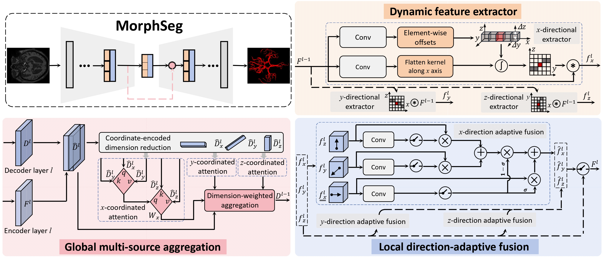

## Project Introduction

MorphSeg is a structure-guided model specifically designed for cerebrovascular segmentation, aiming to identify fine-grained and complex vascular structures.MorphSeg addresses these challenges by leveraging three core modules: Dynamic Feature Extraction, Local Direction-Adaptive Fusion, and Global Multi-Source Aggregation, significantly enhancing the model's ability to capture vascular morphology.

## Model Architecture


## Segmentation Effect Display

To easily demonstrate the segmentation effect of **MorphSeg**, we provide an interactive comparison of slices.  
Slide the slider to view the segmented cerebrovascular structures.
> 🔗 **[Segmentation Demo](https://cicl-lab.github.io/MorphSeg/before_after.html)**

## Failure Cases

Although we have demonstrated the effectiveness of **MorphSeg** through extensive experiments, fine-grained cerebrovascular segmentation remains a challenging task.  
Here, we present some **failure cases**, where **blue** and **green** represent **False Negative (FN)** and **False Positive (FP)** regions, respectively.  
Optimizing these regions will be a major focus of our future work.


## Datasets

MorphSeg is evaluated on two publicly available datasets:
1. **CereVessMRA**:
   - This dataset consists of 271 manually annotated 3D volumes , including both healthy and pathological samples.
   - A five-fold cross-validation strategy was applied, with 216 samples for training and 55 samples for testing.
   - Reference: Guo, B., Chen, Y., Lin, J., Huang, B., Bai, X., Guo, C., Gao, B., Gong, Q., Bai, X. (2024). *Self-supervised learning for accurately modelling hierarchical evolutionary patterns of cerebrovasculature*. Nature Communications, 15(1), 9235.

2. **COSTA**:
   - COSTA is a multi-center TOF-MRA dataset  with a total of **355 samples*,specifically designed to validate segmentation models across different imaging settings, such as acquisition devices and scanning resolutions
   - A five-fold cross-validation strategy was applied, with 284 samples for training and 71 samples for testing.
   - Reference: Mou, L., Yan, Q., Lin, J., Zhao, Y., Liu, Y., Ma, S., Zhang, J., Lv, W., Zhou, T., Frangi, A.F., et al. (2024). *COSTA: A multi-center TOF-MRA dataset and a style self-consistency network for cerebrovascular segmentation*. IEEE Transactions on Medical Imaging.

## Installation Guide 

### 1. Operating System
We recommend running **MorphSeg** on a **Linux system** for optimal performance and compatibility.

### 2. Hardware Requirements
We suggest using **RTX 4090 (24GB)** for training. Of course, higher computing power allows for better configurations, resulting in improved model performance.

### 3. Recommended Configuration
- **PyTorch**: 2.1
- **CUDA**: 11.8

### 4. Installation Steps
#### Clone the MorphSeg repository:
```bash
git clone https://github.com/CICL-Lab/MorphSeg
```

#### Install `dynamic_network_architectures`:
For the acquisition and installation of **dynamic_network_architectures**, please refer to the [official repository](https://github.com/CICL-Lab/dynamic_network_architectures/tree/main).

#### Install MorphSeg:
```bash
cd path/MorphSeg
pip install -e .
```

### 5. Data Preparation
#### Data Structure
Please refer to [Example Data](https://github.com/CICL-Lab/MorphSeg/tree/main/DataSample/Dataset001_Cerebrovascular) to configure the file structure and set up the `dataset.json` file. The folder should be named as `Dataset[Taskid]_Cerebrovascular`.

#### Environment Variables Setup
Refer to [nnUNetv2 Documentation](https://github.com/MIC-DKFZ/nnUNet/blob/master/documentation/dataset_format.md) for more details.
```bash
export nnUNet_raw="/root/autodl-tmp/MorphSeg_raw"  
export nnUNet_preprocessed="/root/autodl-tmp/MorphSeg_preprocessed"
export nnUNet_results="/root/autodl-tmp/MorphSeg_results"

# Fix multi-threading issues:
export TORCH_COMPILE_DISABLE=1
```
#### Experiment Configuration and Preprocessing  
To perform experimental preprocessing and configuration:
```bash
MorphSeg_plan_and_preprocess -d [Taskid] --verify_dataset_integrity

# Example:
MorphSeg_plan_and_preprocess -d 1 --verify_dataset_integrity
```
### 6. Hyperparameter Settings
We recommend the following hyperparameters:
- **batchsize**: 2 (line in 185 at Path/MorphSeg_preprocessed/Dataxxx_xxx/nnUNetPlans.json) 
- **epoch**: 1500 (line in 152 at Path/MorphSeg/nnunetv2/training/nnUNetTrainer/nnUNetTrainer.py) 

## Run
To begin model training, execute the following command:

```bash
MorphSeg_train [Taskid] 3d_fullres [fold]
```

Example:
```bash
MorphSeg_train 1 3d_fullres 5
```
The training records and testing results are located in Path/MorphSeg_results/Dataxxx_xxx.
